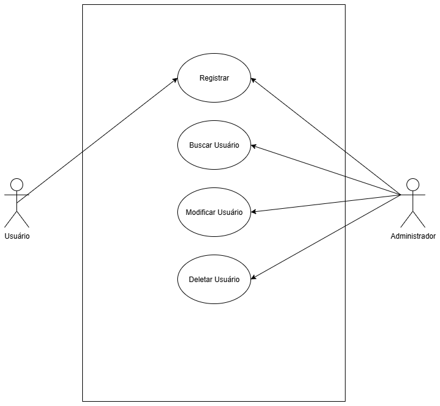
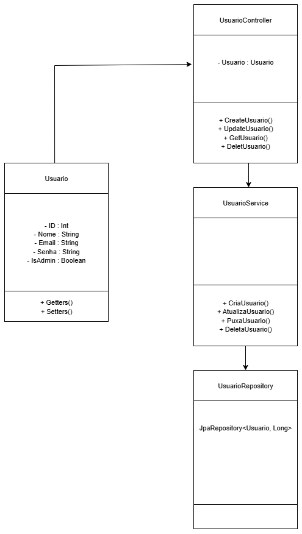

# 📌 Sistema de Cadastro de Usuários - Spring Boot + Supabase

## 1. Objetivo
Este projeto tem como objetivo implementar um sistema simples de cadastro de usuários, utilizando **Spring Boot** para o back-end e **Supabase (PostgreSQL)** para persistência dos dados.  
A entrega inclui documentação, diagramas e código-fonte do sistema.

---

## 2. Diagramas

### 2.1 📊 IDEF0
O diagrama IDEF0 representa a visão de alto nível do sistema, mostrando entradas, saídas, mecanismos e controles.


---

### 2.2 🎭 Diagrama de Caso de Uso
O diagrama de caso de uso ilustra as interações entre os atores e o sistema, destacando as funcionalidades disponíveis.  



---

### 2.3 🧩 Diagrama de Classes
O diagrama de classes mostra a estrutura interna do sistema, incluindo entidades, controladores, serviços e repositórios.  



---

## 3. Requisitos Funcionais
- ✅ Cadastrar usuário  
- ✅ Consultar usuário  
- ✅ Atualizar usuário  
- ✅ Deletar usuário  

---

## 4. Estrutura do Projeto
```
/src
  /main
    /java/br/com/cadastro/Usuario
        /controller
            UsuarioController.java
        /model
            Usuario.java
        /repository
            UsuarioRepository.java
        /service
            UsuarioService.java
    /resources
        application.properties
pom.xml
README.md
CasosDeUso.png
IDEF0.png
DiagramaDeClasses.png
```

---

## 5. Tecnologias Utilizadas
- ☕ Java 21  
- 🌱 Spring Boot 3.5  
- 🐘 PostgreSQL (Supabase)  
- 🧩 Spring Data JPA  
- ⚡ Maven  
- 📂 GitHub Codespaces / VSCode  

---

## 6. Endpoints REST

### Criar usuário
```http
POST /usuarios/criar
```

### Buscar todos os usuários
```http
GET /usuarios
```

### Atualizar usuário
```http
PUT usuarios/atualizar/{id}
```

### Deletar usuário
```http
DELETE /usuarios//deletar/{id}
```

---

## 7. Equipe e Desenvolvimento
- Desenvolvimento em **camadas** (Controller → Service → Repository → Banco de Dados).  
- Git utilizado para versionamento e organização do trabalho.  
- Diagramas elaborados para documentar os requisitos, arquitetura e estrutura do sistema.  

---

## 8. Conclusão
O sistema cumpre os requisitos funcionais propostos e demonstra a integração entre **Spring Boot** e **Supabase** para a construção de uma API REST simples e bem estruturada.  
